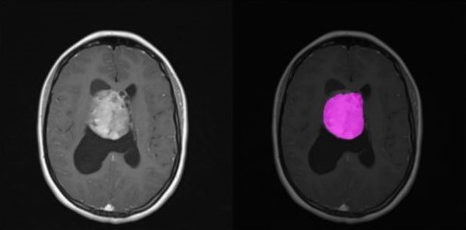

<h1 align="center"> 
    NeuroInsight AI: Revolutionizing Brain Tumor Diagnosis
</h1>

---

## 📝 Overview

**NeuroInsight AI** is an AI-powered platform designed to assist doctors in diagnosing brain tumors with precision and speed. By combining advanced biomedical image segmentation and natural language models, the system empowers healthcare professionals to make more informed decisions, ultimately saving lives. 

## ✨ Features 

- **Accurate segmented masks**: Provides high-precision segmentation of medical scans, ensuring accurate representation of tumor regions.
- **Future treatment recommendations**: Suggests potential future treatments based on scan results and patient symptoms, enabling better healthcare.
- **Comprehensive reports**: Automatically generates detailed reports combining scan results, symptoms, and treatment suggestions for doctors' easy reference.
- **Enhances diagnostic accuracy**: Helps doctors make informed judgments about the presence and severity of brain tumors, aiding in early detection and better treatment planning.
- **Faster diagnosis**: Increases the speed of diagnosis, reducing delays. This could prevent deaths in which late diagnosis is the main cause which are 30% of the cases.
- **24/7 patient support**: Offers a patient chatbot available at all times for inquiries, ensuring constant access to information. The chatbot provides emotional support, reassures patients, and keeps them positive during the entire process.


## ⚙️ Components and Working

- **Biomedical Image Segmentation**: Using a U-Net architecture with an InceptionResnet V2 backbone, the system precisely segments brain tumor regions belonging to 5 different classes with an F1 score of 88%. 
- **Natural Language Processing (LLM)**: A fine-tuned Llama 3 model processes patient symptoms and combines them with scan results for tailored diagnosis suggestions.
- **Hybrid Pipeline**: Integrates image analysis and NLP for generating a comprehensive diagnosis report. This combined output gives medical professionals an overall view of the patient's condition.

## 📊 Results 

The platform delivers accurate segmented images that clearly outline the tumor regions, accompanied by a detailed report. Below are example outputs of the scans and corresponding segmented masks, showcasing the precision and effectiveness of the AI model. 

- Tumor masks: 
  
- Reports: 
    - Yet to be added

## 🛠️ Installation and usage

To install and set up NeuroInsight AI, clone the repository and install the required Python packages.

```bash
git clone https://github.com/username/NeuroInsightAI.git
cd NeuroInsightAI
pip install -r requirements.txt 
```

Once you've installed the required dependencies, you can load the pre-trained model and feed it an MRI scan for brain tumor analysis. Here is an example:

```python
import tensorflow as tf
import cv2
import numpy as np

# Load the trained model (path to the saved model file)
model = tf.keras.models.load_model('path_to_saved_model')

# Load an MRI scan
mri_scan = cv2.imread('path_to_mri_scan', cv2.IMREAD_COLOR)

# Predict segmentation mask
prediction = model.predict(np.expand_dims(mri_scan, axis=0))

```

## 🚀 Future Plans 

NeuroInsight AI's next phase aims to make the system **completely autonomous**, enabling it to handle end-to-end diagnosis without human intervention. The goal is to reach a wide range of people through **scalable AI solutions** that can be deployed across different healthcare settings globally which could potentially save 20% of the lives in rural areas where improper healthcare support is the cause of death.


## 👨‍💻 Author 

**Achintya Varshneya**

I'm an AI/ML enthusiast with a passion for turning ideas into reality. Always up for a new challenge, especially if it involves cool tech. Let’s just say, I like to keep things innovatively awesome! 😎